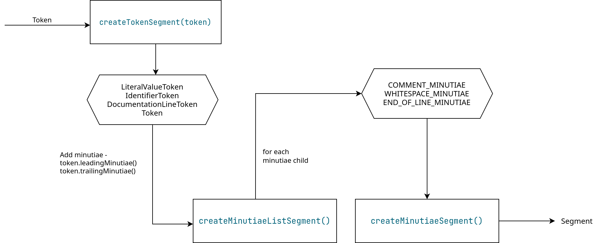
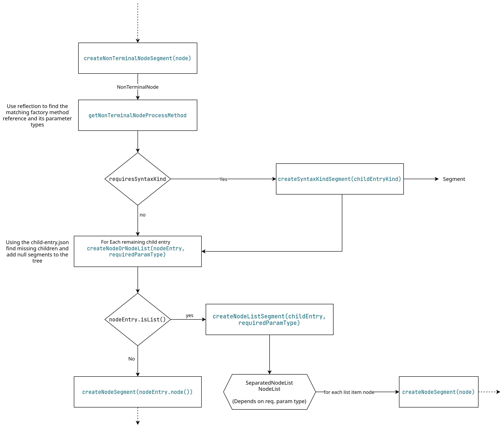
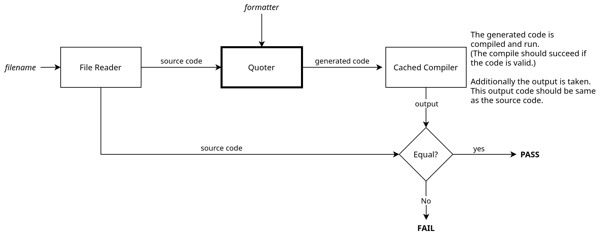

# Quoter Tool - Implementation

> This document explains the implementation of the tool in detail.

## Implementation

### Overview

Following is the base implementation of the tool.

- The tool will input the source ballerina code and parse it into a Syntax Tree using the `SyntaxTree` API.
- Using the root node it provides, the tool would then attempt to transform the tree of Node into a tree of Segments.
  These segments will represent every API call required to generate the Java code.
- Using the root segment, the formatter would insert the required formatting (adding whitespaces, rearranging code
  segments) and finally output the generated code.


### Parsers

Currently, the parsing happens as,

1. Module parsing - parse directly as is, results in `ModulePartNode`
2. Statement parsing - parse by putting code in a function, results in `StatementBlockNode`
3. Expression parsing - parse by putting as a `returns` statement in a function, results in `ExpressionNode`

Parser is given a timeout (default `100ms` but can be changed) and the parser will terminal with an exception if parsing
within that time-frame was not possible.

### Node to Segment Tree Conversion

#### Segments

Segments are nodes that make up the Syntax API calls.

- `NodeFactorySegment` - Node factory API call generation segment. These segments are the sections of the generated code
  that follows the format `NodeFactory.<Type>createNodeType(param1, param2)`. These segments denote the non-terminal
  nodes of the segment tree. Parameters are the child segment nodes.
- `CodeSegment` - Segment which encompasses a code segment. These can be any random code segments, number literals,
  etc... For example, `null` is a code segment. These are terminal nodes in the segment tree.
- `StringSegment` - Special code segment which denotes a string literal. Because this is a string literal, these would
  escape the special characters when converted to a string. `"Hello"` is a string segment. These are terminal nodes in
  the segment tree.
- `SyntaxKindSegment` - Segment which denotes a `SyntaxKind`. These will follow the format `SyntaxKind.ABC_KIND`.

#### Segment Factories

Recursively transforms the `Node` tree into a `Segment` tree.

##### NodeSegmentFactory

The public interface to start transforming starting from the root node.


##### TokenSegmentFactory

Transforms `Token` into `NodeFactorySegment`. Adds minutiae nodes as well.



##### NonTerminalSegmentFactory

Transforms `NonTerminalNode` into `NodeFactorySegment`. This uses reflection to find the correct method call and to
match parameter names.



#### Use of reflection

Factory calls for `NonTerminalSegmentFactory` calls are found using reflection. If the node type
is `FunctionDefinitionNode` then the factory call is `createFactoryDefinitionNode`. Then the child node names are
matched with the `child-nodes.json` to find the missing nodes. These missing nodes will be `CodeSegment(null)` and the
other node segments will be added as parameters.

### Output Formatting

After the segment tree has been constructed, the tree will be formatted. Here a few main strategies are implemented.

#### NoFormatter

Directly convert the segment tree into a string of method calls without any whitespaces.

```java
NodeFactory.createModulePartNode(NodeFactory.createNodeList(),NodeFactory.createNodeList(),NodeFactory.createToken(SyntaxKind.EOF_TOKEN,NodeFactory.createEmptyMinutiaeList(),NodeFactory.createEmptyMinutiaeList()))
```

#### Default Formatter

Formats the output of the segment tree string by adding whitespaces. No reorganization of the tree is done. The
formatting is done to bring the output similar to the output of the [dart formatter](https://dart.dev/tools/dartfmt).

```java
NodeFactory.createModulePartNode(
        NodeFactory.createNodeList(),
        NodeFactory.createNodeList(),
        NodeFactory.createToken(
        SyntaxKind.EOF_TOKEN,
        NodeFactory.createEmptyMinutiaeList(),
        NodeFactory.createEmptyMinutiaeList()
        )
        )
```

#### VariableFormatter

Reorganizes and formats the code so that each Node is defined in a new line and group the token creation variable
definitions. Traverses the Segment tree again to format. The final output will always be assigned to a variable
named `modulePartNode`.

```java
MinutiaeList trailingMinutiae,leadingMinutiae;

        NodeList<ImportDeclarationNode> nodeList=NodeFactory.createNodeList();

        NodeList<ModuleMemberDeclarationNode> nodeList1=NodeFactory.createNodeList();

        leadingMinutiae=NodeFactory.createEmptyMinutiaeList();
        trailingMinutiae=NodeFactory.createEmptyMinutiaeList();
        Token token=NodeFactory.createToken(SyntaxKind.EOF_TOKEN,leadingMinutiae,trailingMinutiae);

        ModulePartNode modulePartNode=NodeFactory.createModulePartNode(nodeList,nodeList1,token);
```

#### TemplateFormatter

Embeds the output to a template text. Here `%s` will be replaced from the generated code. This uses
an `internalFormatter`(one of the above three formatters) to format the code which will be placed in the template.
Following is `TemplateFormatter` with `DefaultFormatter` as the internal formatter.

```java
import io.ballerina.compiler.syntax.tree.*;

class QuoterTest {
    public static void main(String[] args) {
        Node node = NodeFactory.createModulePartNode(
                NodeFactory.createNodeList(),
                NodeFactory.createNodeList(),
                NodeFactory.createToken(
                        SyntaxKind.EOF_TOKEN,
                        NodeFactory.createEmptyMinutiaeList(),
                        NodeFactory.createEmptyMinutiaeList()
                )
        );

        System.out.println(node.toSourceCode());
    }
}
```

### Configuration Management

To change how the internal settings work, the `QuoterConfig` class can be used.

## Testing

The tests in this project are done in following manner.


